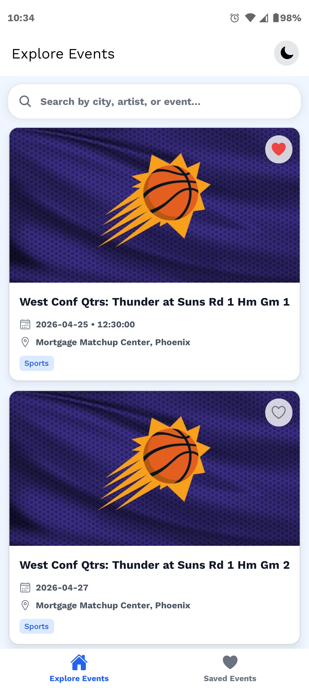
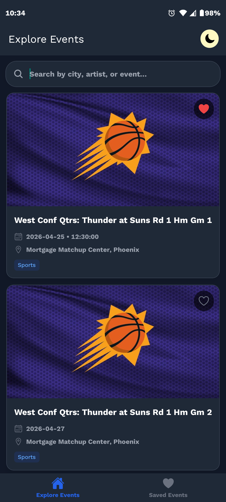
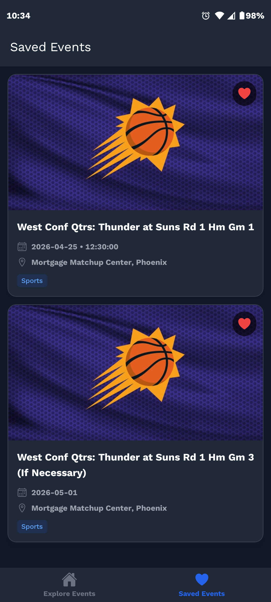
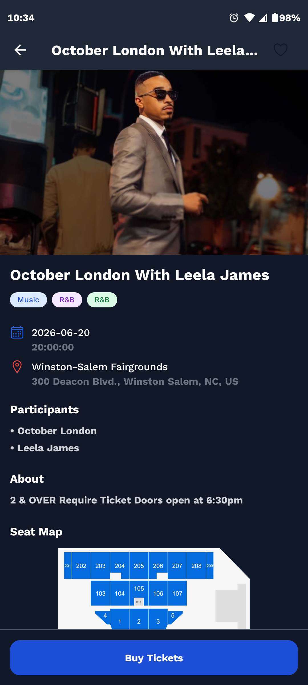

<div align="center">

# 🎟️ Ticket Master

A modern mobile event discovery application built with **Expo + React Native**.  
Browse worldwide events, search by city, view details, and save favourites with a fast and smooth experience.


</div>

---

## 📥 Download & Demo

- 📦 **APK Download:** [LINK](https://drive.google.com/file/d/1GqA_2zOqXgKh4wSBSHSUbO8FFIz-HZ4y/view?usp=sharing)
- 🎥 **Video Demonstration:** [LINK](https://drive.google.com/file/d/1xGjqF6V272do2ZeYZZw8Tv9uGCHTaquo/view?usp=sharing)

---

## ✨ Features

- 🌍 Browse live events from around the world
- 🔍 Search events by city
- 📄 View full event details
- 🎟️ Direct ticket purchase links
- ❤️ Save favourite events
- ⚡ Fast API caching with RTK Query
- 🌙 Dark mode support
- 📱 Smooth mobile-first UI

---

## 🛠 Tech Stack

- **React Native**
- **Expo Prebuild**
- **Expo Dev Client**
- **TypeScript**
- **Redux Toolkit**
- **RTK Query**
- **MMKV Storage**
- **Nativewind**

---

## 📁 Project Structure

```bash
src/
 ├── redux/            # Redux toolkit with rtq query
 ├── components/       # Reusable UI components and layouts
 ├── constants/        # App constants
 ├── navigation/       # Stack + Tabs
 ├── screens/          # App screens
 ├── types/            # TypeScript types
 └── utils/            # Helpers
```

---

## 🧠 Architecture & Technical Decisions

### State Management

Used **Redux Toolkit + RTK Query** for scalable state management, API caching, request deduplication, loading states, and pagination.

### Navigation

Used **React Navigation** with Stack + Bottom Tabs for clean separation between Home, Favorites, and Details screens.

### Local Storage

Used **MMKV** for persistent favorites because it is significantly faster than AsyncStorage and ideal for lightweight offline storage.

### UI Styling

Used **NativeWind** for utility-first styling, enabling faster UI development and reusable design patterns.

### Maps Integration

Used **OpenStreetMap (Leaflet via WebView)** instead of Google Maps due to API billing/key requirements during development.
The map module is isolated and can be easily replaced with `react-native-maps` later.

### Performance

Used **FlatList** with pagination and memoized components to keep scrolling smooth with large event lists.

### Error Handling

Implemented loading states, empty results state, and network failure feedback for better user experience.

---

## 📱 App Preview

<table>
<tr>
<td align="center">
<br/>
<sub><b>Splash Screen</b></sub>
</td>

<td align="center">
<br/>
<sub><b>Home Screen</b></sub>
</td>

<td align="center">
<br/>
<sub><b>Dark Mode</b></sub>
</td>
</tr>

<tr>
<td align="center">
<br/>
<sub><b>Favourites</b></sub>
</td>

<td align="center">
<br/>
<sub><b>Search by City/Text</b></sub>
</td>

<td align="center">
<br/>
<sub><b>Event Details</b></sub>
</td>
</tr>
</table>

---

## 🚀 Getting Started

## 1️⃣ Clone Repository

```bash
git clone https://github.com/mehedih20/ticket-master.git
cd ticket-master
```

## 2️⃣ Install Dependencies

```bash
npm install
```

## 3️⃣ Setup Environment Variables

Create `.env.local`

```env
EXPO_PUBLIC_BASE_API=https://app.ticketmaster.com/discovery/v2
EXPO_PUBLIC_API_KEY=your-api-key
```

## 4️⃣ Generate Native Folders

```bash
npx expo prebuild
```

## 5️⃣ Run Android

```bash
npx expo run:android
```

## 6️⃣ Run iOS (Mac)

```bash
npx expo run:ios
```

---

## 📦 Build APK / AAB

```bash
npx expo login
npx eas build:configure
npx eas build --platform android
```

---

## 🔄 Common Commands

### Clear Cache

```bash
npx expo start -c
```

### Rebuild Native Code

```bash
npx expo prebuild
```

---

## 👨‍💻 Author

**Mehedi Hasan**

---

<div align="center">

Made with ❤️ using React Native + Expo

</div>
